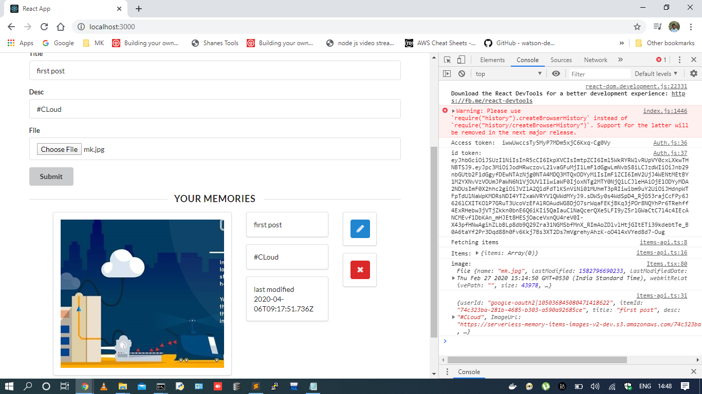
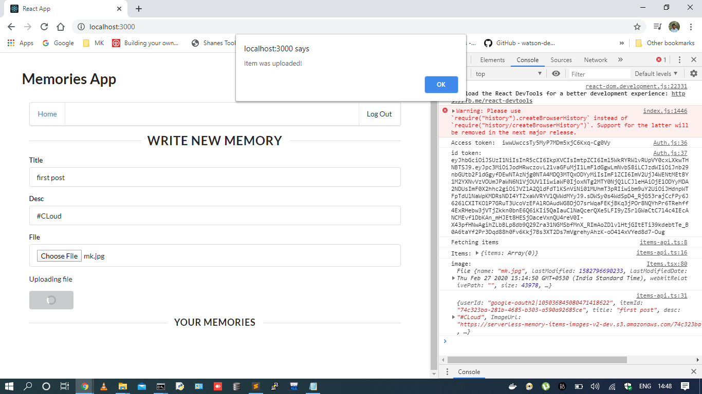

# Serverless Memories App

Github Repo Link: https://github.com/mohankrishna225/CloudCapstone_Udacity 



          
    


## Functionality 

- The application allows users to create, update, delete memory items.
- The application allows users to upload a file. 
- The application only displays items/memories for a logged in user.
- A user needs to authenticate in order to use an application

## Architecture

- Data is stored in a table with a composite key.

```
KeySchema:
      - AttributeName: partitionKey
        KeyType: HASH
      - AttributeName: sortKey
        KeyType: RANGE
```

- items are fetched using the `query()` method and not `scan()` method (which is less efficient on large datasets)


# How to run the application

## Backend

To deploy an application run the following commands:

```
cd backend
npm install
sls deploy -v
```

## Client

To run a client application first edit the `client/src/config.ts` file to set correct parameters. And then run the following commands:

```
cd client
npm install
npm run start
```
